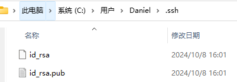

## 设置用户

git config --global user.name "Your Name"
git config --global user.email "email@example.com"

新建文件夹：
 mkdir +文件夹名字
新建文件：
touch +文件名
删除文件
rm 文件名.文件类型
删除文件夹：
rm -r 文件夹删除文件夹（要回到上一级文件夹才可以删）

初始化本地仓库
 git init
查看ssh key
~/.ssh
测试ssh
ssh -T git@github.com
连接远程仓库
$ git
algorithm是给仓库起的名字 后面是地址 ssh
断开
git remote remove + 名字

git remote -v

提交所有变化到暂存区
git add -A
添加备注
git commit -m "修改注释"
推送代码
第一次：git push -u 仓库名称（上面自己取的名字，如algorithm） 分支
后续：git push 名称 分支
git push 仓库名 分支 -f 强制推送

文件下拉
git pull 仓库名

删除分支
git push 仓库名字 -d 分支名
查看分支
git branch -a

更换分支
git checkout 分支名
git checkout -b  分支名 // 新分支创建的同时切换分支


## 连接远程仓库

**以 `ssh` 链接。**

- 先初始化文件：git init

- 连接远程仓库：git remote add 连接名 git@github.com:hdwan/xxxxxxx.git

    > 注意：连接成功后，此时本地是没有远程仓库的信息的，需要拉取远程仓库的数据到本地，`clone` 也可以。

- 查看连接状态：git remote -v

- 克隆远程仓库：保证本地和远程同步：git pull 连接名 分支

- 接着按照提交步骤走就行

- 本地和远程分支不一样 调整分支：git checkout 分支名

## 配置 ssh 

打开 `GitBash` 

输入：

``` bash
cd ~/.ssh
```

如果不存在 `.ssh` 文件夹，则需要创建：

```java
ssh-keygen -t rsa -C "example@163.com"
```

会默认生成 `.ssh` 文件。



然后去 `github` 上去将 `pub` 里的文件拷贝进去，建立 `ssh` 连接即可。

